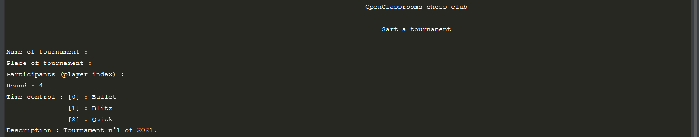
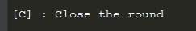

# openclassrooms_chess_club.py #

1.  [Description](#description)
2.  [Utilisation](#utilisation)
    1.  [Page d'accueil](#PAGE-D-ACCUEIL)
    2.  [Start a tournament](#START-A-TOURNAMENT)
    3.  [Finished tournaments](#FINISHED-TOURNAMENTS)
    4.  [Players list](#PLAYERS-LIST)
    5.  [Tournament in progress](#TOURNAMENT-IN-PROGRESS)
    6.  [Rapport flake8](#FLAKE-8)
3.  [Installation](#installation)
    1.  [Environnement virtuel](#environnement-virtuel)
    2.  [Requierements](#requierements)
4.  [À propos](#a-propos)
    1.  [Packages](#packages)
    2.  [Bugs connus](#bugs-connus)
    3.  [Améliorations futures](#améliorations-futures)

 
## 1. Description  ##

    Ce script à été réalisé dans le cadre d'un projet du parcours
    'Développeur d'application - Python' d'OpenClassROoms.

\
\
OpenClassrooms_chess_club.py est un gestionnaire (simplifié) de tournoi d'échec, qui permet :
- La création d'une base de données joueurs.
- La création et la gestion de tournoi avec enregistrement en base de données.
- L'appariements pour les matchs est basé sur le système Suisse, sous une forme simplifié de l'appariement officiel de la Fédération Française d'Échecs (FFE) (ex : il n'y a pas d'équilibrage des couleurs).
- La visualisation de la liste des joueurs et des tournois terminés.

Le script s'utilise via une interface terminal.\
La base de données est en format .json.

 
## 2. Utilisation  ##

**Attention :**
- L'affichage à été pensé pour du 16/9. Pour un affichage correct, il est nécessaire que la fenêtre du terminal soit large.

\
Pour lancer le script, la ligne de commande est :

 
###### PAGE D'ACCUEIL :  ######

0. Création d'un nouveau tournoi (ou gestion du tournoi si un en cours )
1. Affichage des données des tournois terminés.
2. Affichage et enregistrement des joueurs en base de données.
3. Quitter le script.

 
###### START A TOURNAMENT :  ######

**Attention :**
- Afin de pouvoir débuter un tournoi, il est nécessaire d'avoir des joueurs enregistrés dans la base de données.

\
Succession d'inputs pour renseigner les paramètres du tournoi.\
Les paramètres avec une valeur, sont ceux qui ont une valeur par défaut.\
Utiliser la touche entrée pour conserver la valeur par défaut.

 
###### FINISHED TOURNAMENTS :  ######

Voici un affichage avec tournois terminés dans la base de données :

.png)

 
###### PLAYERS LIST :  ######

Voici un affichage avec quelques joueurs dans la base de données :

.png)
- N : Ajout d'un joueur dans la base de données.
- A : Tri des joueurs par ordre alphabetique (nom de famille)
- I  : Tri des joueurs par défaut. L'index joueur en base de données.
- E : Tri des joueurs par classement Elo décroissant. 

L'option [N] initie une succesion d'inputs pour renseigner les informations du joueur :

 
###### TOURNAMENT IN PROGRESS :  ######

.png)

\
Durant un tournoi, la seule chose à faire est de désigner les vainqueurs des matchs.\
Pour cela, il suffit d'entrer le numéro d'un match (les numéros de match sont indiqués en première ligne).\
Puis de désigner le vainqueur.

\

L'option pour clôturer le round sera disponible lorsque tous les matchs du round seront finis.

Laissant place au round suivant.

 
###### RAPPORT FLAKE-8 :  ######

Pour générer les rapports flake-8, la commande est :

Les rapports seront générés dans le dossier  du réportoire de travail.\
Dans lequel on trouve le fichier , qui est la table des rapports.

 
## 3. Installation  ##

**Remarque**

Dans les sous-sections suivantes, les lignes de commande sont exécutée depuis le répertoire de travail :\
\
Les différents fichiers du script s'y trouvent.\
Pour utiliser les lignes de commandes, il faut que votre répertoire de travail, soit, celui où se trouvent les différents fichiers du script.

 
### i. Environnement virtuel  ###

Sous Linux, avec l'IDE PyCharm.

- Pour créer l'environnement virtuel lancer la commande suivante :\
\
Cela créra un environnement virtuel nommé 'env'.

- Si l'environnement virtuel est actif, son nom apparaîtra au début de la ligne de commande, comme suit :\

- Sinon, pour activer l'env, il faut lancer la commande :\

\
Sous Windows, avec l'IDE PyCharm.

- Pour créer l'environnement virtuel lancer la commande suivante :\
\
Cela créra un environement virtuel nommé 'env'
- Si l'environnement virtuel est actif, son nom apparaîtra au début de la ligne de commande, comme suit :\

- Sinon, pour activer l'env, il faut lancer la commande :\

 
### ii. Requierements  ###

Une fois l'environnement virtuel activé, lancer la commande suivante :

Cela installera tous les modules renseignés dans le fichier requierements.txt.

 
## 4. À propos  ###
 
### i. Packages  ###

La structure de openclassrooms_chess_club.py est basé sur le modèle MVC (Model View Controller).\

- Les models, gèrent les transformations.
- Les views, gèrent les affichages et les inputs utilisateurs.
- Les controllers, coordonnent les différentes méthodes et fichiers. Permettent la liason entre les views et les models.

 
### ii. Bugs connus  ###

- Le script se termine si l'on essai de désigner un vainqueur à un match exempté (match avec un joueur sans adversaire).
N'entraine pas d'erreur sur le tournoi en question. Relancer le script est suffissant pour revenir à la gestion du tournoi.
      
Si vous trouvez un bug, merci de me le signaler sur l'adresse\
gl_openclassrooms@laposte.net

 
### iii. Amélioration futures  ###

- Mise en évidence des vainqueurs de toursnois.
- Horodage des tournois/rounds/matchs.
- Mise à jour (simplifié) du score Elo des joueurs après victoire/nul/défaite d'un match. Respectivement +7/+0/-7.
- Afficher les détails d'un tournoi terminés (détails des matchs etc.).
